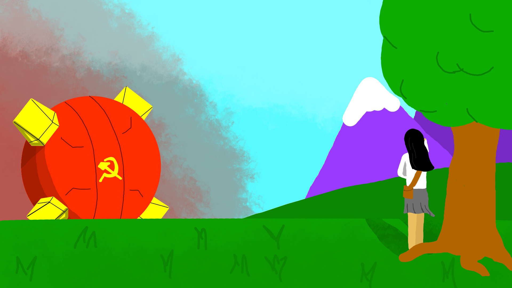
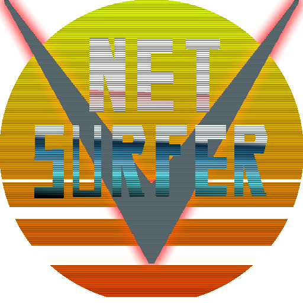
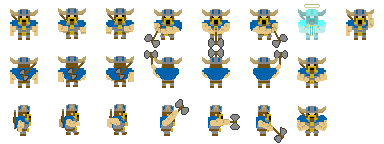

## Games I've Made

**About These Projects:** At school, we had the opportunity to create games as part of an elective class. These games are long-term projects under a mini-scrum development strategy. Each was developed in Unity as an individual project or part of a team. Below are the more fun or interesting projects I've been a part of.

Due to my disdain for using mismatching art assets, I did the sprite work for these games. Our Katamari game, however, required a multitude of objects, which made independent development of 3D models impossible for a class project.

> **NOTE**: These github repositories are cross-uploads from Unity's version control system, and as such pulls, pushes, and contribution histories are not preserved. Each game will have a link to other contributors' github profiles here and in its own README.md

### 1. [Grover Man](https://github.com/HugheZ/Grover-Man)

#### Contributors:
* [Ben Mumaw](https://github.com/Nimitz)
* [Nathan Stoner](https://github.com/Naxhi)

Grover Man is a satirical take on our college's personality; most students are conservative-libertarian. As such, we decided to model the 'perfect Grover' as a freedom fighter, saving his fellow students from the forces of Communism under the reign of Mecha Karl Marx. This game features two levels, four unlockable achievements, easter eggs, simple state-based AI, and a three-stage boss battle. Sprite design and voice acting were both done in-house.

### 2. [One Trillion Lions vs. The Sun 2](https://github.com/HugheZ/One-Trillion-Lions-vs-The-Sun/tree/master)

This is my first solo 3D game, and it plays off the following thought experiment: In a battle of power, who would win? One trillion lions, or the sun?

>   "It depends if we can collapse them to their Schwarzschild radius." - Me

>   "Well, are they all working together, or are they independent?" - My programming 2 professor

>   "I feel that if they can get to the sun then organization is the least of their concerns." - The student who inspired me to make this game

It includes two different enemies, an asteroid that fractures into more when you shoot it and a flare-shooting star, as well as a progressive difficulty scale. All voxel models and textures were done in the span of a week to remove placeholder models, for better or worse.

### 3. [Communisuto Damacy](https://github.com/HugheZ/Communisuto-Damacy)

#### Contributors:
* [Nathan Stoner](https://github.com/Naxhi)

Communisuto Damacy tells an alternate story of Grover Man from the Communist point of view. You play as a glorious ball of stuff that must roll around a small American office and pick up as much stuff as possible, just like the original Katamari Damacy. The ball grows in size and rolls differently if you pick up special "irregular" objects, unless you are so large that they wouldn't matter anyways. The game ends after a time limit, and your success is judged by the size of the ball you make.

### 4. [Net Surfer](https://github.com/HugheZ/Net-Surfer)

#### Contributors:
* [Nathan Stoner](https://github.com/Naxhi)

My most recent game, Net Surfer, is based on the 80s view of a cyberpunk future. You play as AxelLee.exe, the first future ninja robo cyber cop. You have to race through the internet, shooting down malicious entities and surviving bloatware obstacles. This is an infinite runner with progressive speedup, and it is by far my most visually stunning game. It is a low-power single-scene game, and it takes advantage of a post-processing VHS effect and vignette for an old-school CRT TV style. Additionally, it uses Unity's inverse kinematic system and Blender's quick skeletal setup system to implement a fluid point animation, which draws the user towards their crosshair even if it is lost in the effects.

### 5. D&D&D: Dungeons and Dwarves and Deception
* [Mark Brestensky](https://github.com/BrestenskyMW1)
* [Paul Hodge](https://github.com/PurplWarrior22)

This is a top-down, competetive, mini-dungeon game built for local, LAN, and Internet multiplayer on the PS4. The game can be best described as a mashup of Ultimate Chicken Horse and Crawl. You will play as a dwarf who must get to the end of a dungeon by killing the competition. In each trap phase, you place a trap in the dungeon room. During the play phase, points are awarded for kills, assists, and success. If no dwarves die, no points are awarded.

Due to losing team members, we had to unfortunately cut back on scope. The dungeon-building mechanic has been scrapped, but we added in a new game ending and local multiplayer to compensate.

After each sprint, an update on the game's progress will be posted here.

> **NOTE**: A playthrough of the game on YouTube and images of the game will be included here, but due to Sony Interactive Entertainment LLC's Student Development Program, source code cannot be shared publicly. Potential employers, internship coordinators, and grant issuers may receive a copy of the source code and/or executable after contacting me with a request. However, due to the COVID-19 pandemic, we no longer have access to PS4 devkits. The game will be programmed as a PS4-first game, but we cannot guarantee that it will compile without access to these machines. As such, we will eventually be making the source code available, should we determine we are no longer bounded by the contract.
